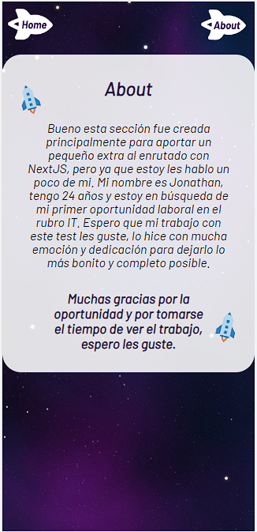

# Intro

El proyecto fue realizado con [SpaceX GraphQL API](https://studio.apollographql.com/public/SpaceX-pxxbxen/variant/current/home). Debido a que en el momento de empezar a realizar el test, la query de misions no estaba trayendo datos, acordamos con Diego Alonso Sanchez Ramirez utilizar los datos de los cohetes para esta prueba.

- Cohete activo o inactivo
- Success rate
- Nombre
- Descripción
- Link a Wikipedia

# Capturas de pantalla de las distintas resoluciones

## Desktop (1920 x 1080)


## Tablet (1024 x 768 )


## Mobile (320 x 670)




# Instrucciones para levantar el proyecto

```
cd 99min-test-front
```

```
npm install
```

```
npm run dev
```

# El por qué de las tecnologías utilizadas

- Typescript:

  - Es de mi preferecia ya que me permite tener más control sobre los potenciales bugs o problemas en el código.
  - Es una de las tecnologías requeridas para el puesto laboral.

- Next:

  - Es un requisito para el puesto
  - Era un bonus dentro del test

- React:
  - Para aprovechar la reutilización de componentes, como por ejemplo, las cards de los cohetes.
  - Era requisito del test.

# Que cambiaría si tuviera más tiempo

- Le agregaría una landing page
- Mejoraría el responsive para más dispositivos
- Agregaría animaciones
